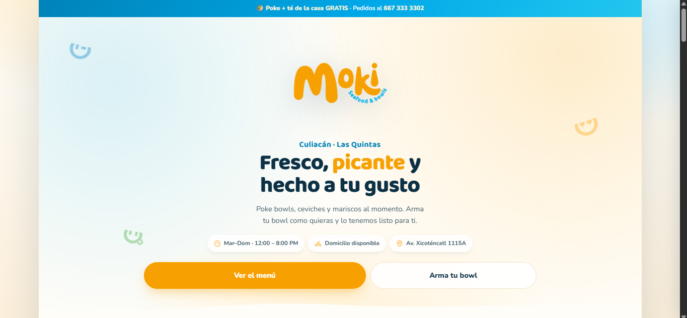
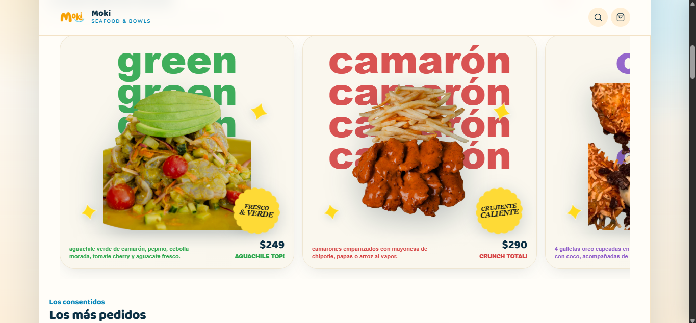
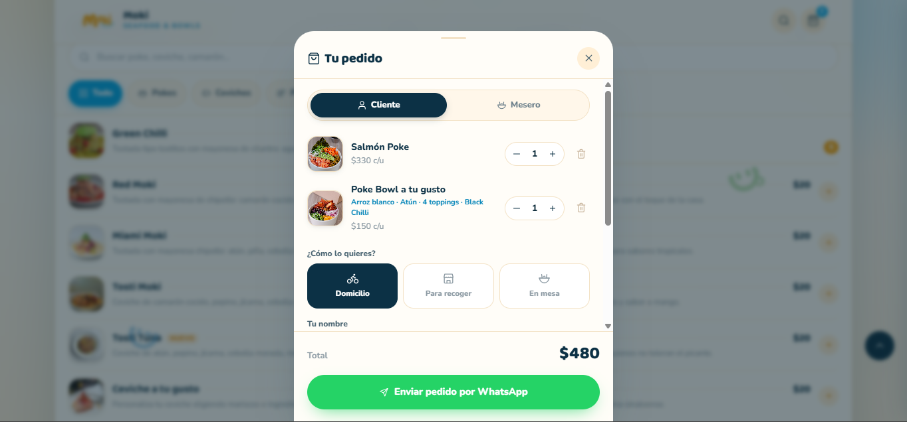

# 🐟 Moki — Seafood & Poke Bowls · Menú digital con pedidos por WhatsApp

> **Demo comercial** para **Moki Seafood & Bowls — Culiacán, Las Quintas**.
> Este repositorio es una **vitrina**: muestra el resultado y la galería; el **código fuente es privado**.

## 🚀 Probar la demo

**👉 [demo-moki.vercel.app](https://demo-moki.vercel.app)** — funciona en móvil y escritorio, sin instalación.

---

## 📸 Galería

| Vista inicial | Los más pedidos |
|---|---|
|  |  |

| Pedido armado → WhatsApp |
|---|
|  |

---

## ✨ Qué incluye

- **Catálogo interactivo** con buscador, categorías (Poke, Ceviches, Mariscos), fotos y precios reales.
- **Arma tu Poke Bowl**: el cliente elige base, proteína, toppings y salsa — algo que por WhatsApp manual es muy tedioso de coordinar.
- **Carrito con modos** *Domicilio / Para recoger / En mesa* y notas para cocina.
- **Pedido a WhatsApp estructurado**: desglose, total, modalidad y datos del cliente, listo para confirmar.
- **Promociones destacadas** (banner de promo del fin de semana) para mover stock.
- **Diseño propio de la marca**: paleta, ilustraciones y tipografía del negocio, no una plantilla genérica.
- **Carga instantánea** (HTML/CSS/JS puro) y **SEO local** con horario, dirección y contacto.

## 🔄 Cómo funciona para el cliente

1. Entra desde el enlace o un **código QR**.
2. Arma su bowl o elige platillos del catálogo en **3 clics**.
3. Toca *“Enviar pedido por WhatsApp”*: el negocio recibe la comanda **calculada** en su chat.

## 🛠️ Tecnologías

`HTML5` · `CSS3` a medida · `JavaScript` vanilla · **Vercel** (CDN global + SSL)

> Sin bases de datos ni servidores: solución estática de bajo costo y cero mantenimiento. El menú se parametriza (logo, colores, productos, teléfono) para adaptarlo a cualquier negocio en menos de una hora.

## 📌 Sobre este repositorio

- ✅ Repositorio **público de vitrina** (imágenes + enlace a la demo en vivo).
- 🔒 El **código fuente no se publica** y el **fork está desactivado**: la plantilla es propiedad de su autor.
- ⚠️ Prototipo creado como propuesta comercial de demostración; **no está afiliado ni respaldado** por el negocio mostrado.

## 📈 ¿Quieres algo así para tu negocio?

Soy **Gustavo Heredia** — TSU en Informática, desarrollo menús digitales y sistemas de pedidos para restaurantes, cafeterías y negocios locales.

- **LinkedIn:** [gustavo-heredia-01567a2b5](https://www.linkedin.com/in/gustavo-heredia-01567a2b5/)
- **Correo:** newpersonal98@gmail.com
- **GitHub:** [Gustav0H2O](https://github.com/Gustav0H2O)

Escríbeme y te devuelvo una demo **con tu marca** en 24–48 h, sin costo ni compromiso.
